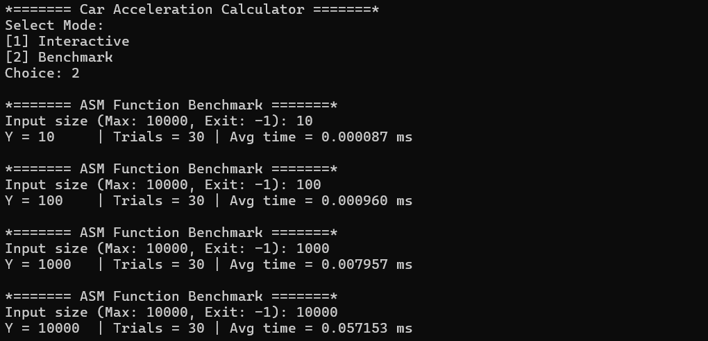
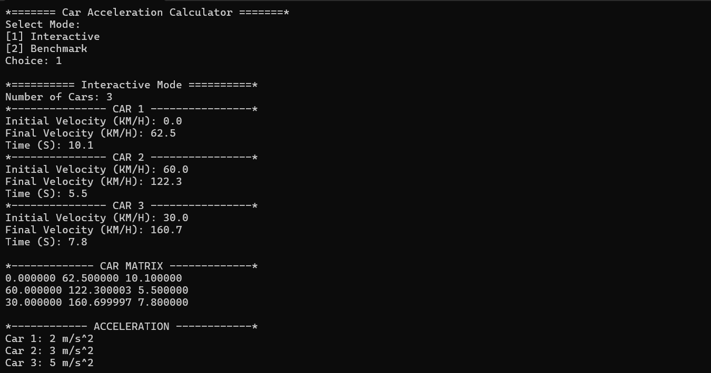
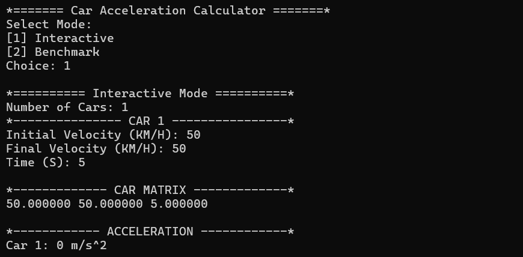
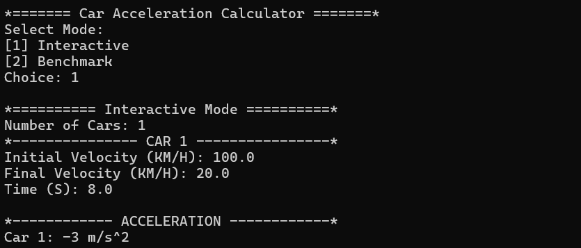
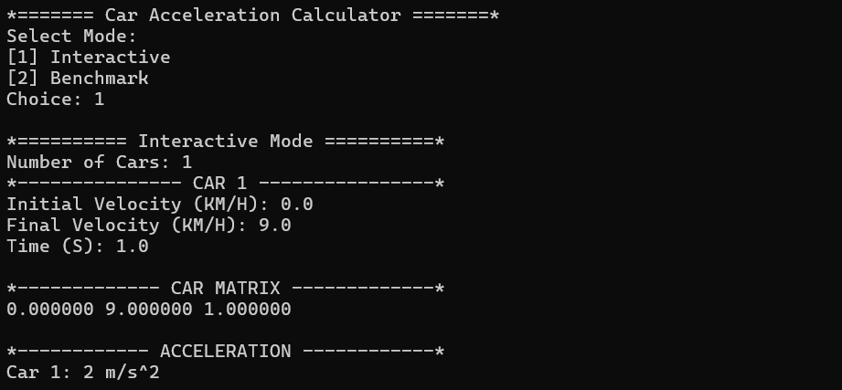
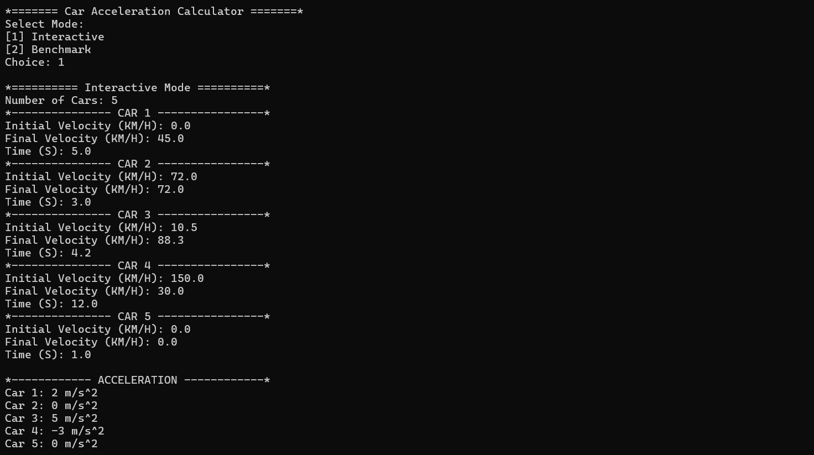

# Car Acceleration Calculator (C + x86-64 Assembly)

An x86-to-C interface programming project that calculates the acceleration of multiple cars given its Initial Velocity (Vi), Final Veolocity (Vf), and Time (T). Input collection and output printing are handled
in C; the actual unit conversion, acceleration calculation, and float-to-integer conversion are performed in a hand-written x86-64 assembly function using scalar SIMD floating-point instructions (`movss`, `subss`, `divss`, `cvtss2si`).

## Formula

```
Acceleration (m/s^2) = (Vf - Vi) / T
```

Where:

- **Vi** - Initial Velocity (KM/H)
- **Vf** - Final Velocity (KM/H)
- **T** - Time (seconds)

Velocities are converted from KM/H to M/S (divided by 3.6) inside the assembly
function before the acceleration is computed. The final result is rounded to the
nearest integer.

## Project Structure

| File                          | Description                                                                                                                                        |
| ----------------------------- | -------------------------------------------------------------------------------------------------------------------------------------------------- |
| `main.c`                      | C driver program. Handles user input, memory allocation, calls into the assembly function, and prints results.                                     |
| `acceleration_calculator.asm` | x86-64 NASM assembly function that performs the KM/H to M/S conversion, computes acceleration for each car, and converts the result to an integer. |

## How to Run

### Requirements

- Windows
- Visual Studio (with the NASM build customization / NASM installed and configured for this project)

### Build

1. Open the project/solution in Visual Studio.
2. Build the solution (`Ctrl+Shift+B`), selecting the desired configuration (Debug/Release, x64).
3. Run the produced executable (`Ctrl+F5` or `F5`).

### Usage

On launch, choose a mode:

```
*======= Car Acceleration Calculator =======*
Select Mode:
[1] Interactive
[2] Benchmark
Choice:
```

**Interactive Mode**: enter `1`, then follow the prompts to enter the number of cars and each car's Vi, Vf, and T values. Example:

```
Number of Cars: 3
Initial Velocity (KM/H): 0.0
Final Velocity (KM/H): 62.5
Time (S): 10.1
...
```

**Benchmark Mode**: enter `2`, then enter the number of cars to generate and time (e.g., `10`, `100`, `1000`, `10000`). The program will output the average execution time over 30 runs.

## Performance Results

| Y (cars) | Trials | Avg Time (ms) |
| -------- | ------ | ------------- |
| 10       | 30     | 0.000087      |
| 100      | 30     | 0.000960      |
| 1,000    | 30     | 0.007957      |
| 10,000   | 30     | 0.057153      |

### Analysis

The results show clear linear-time scaling with the number of cars, consistent with the assembly function's single O(n) loop over rows with no nested iteration. Execution time grows from 0.000087 ms at Y=10 to 0.057153 ms at Y=10,000, roughly a 657x increase for a 1000x increase in input size, meaning the per-car cost actually gets slightly cheaper as Y grows (each 10x increase in Y yields only an 8x to 11x increase in time rather than a full 10x). This is expected behavior: at small Y, fixed overhead (the function call itself, warm-up effects, and timer resolution) makes up a larger share of the measured time, while at larger Y that overhead is amortized across more iterations and the timing better reflects the true per-element cost of the scalar SIMD instructions (`movss`, `subss`, `divss`, `cvtss2si`). The consistently sub-millisecond times even at Y=10,000 also reflect that the entire input (120KB for the matrix) comfortably fits in cache, so the loop is not memory-bandwidth-bound.

### Program Output



## Correctness Check

### Test 1: Spec sample

**Input:**

```
3
0.0, 62.5, 10.1
60.0, 122.3, 5.5
30.0, 160.7, 7.8
```

**Expected:** `(62.5-0.0)/3.6/10.1 ≈ 1.72 → 2`, `(122.3-60.0)/3.6/5.5 ≈ 3.15 → 3`, `(160.7-30.0)/3.6/7.8 ≈ 4.65 → 5`
Matches the worked example given directly in the spec.

**Actual Output:**


---

### Test 2: Zero acceleration

**Input:**

```
1
50.0, 50.0, 5.0
```

**Expected:** `(50.0-50.0)/3.6/5.0 = 0 → 0`
Equal initial and final velocity should produce zero acceleration.

**Actual Output:**


---

### Test 3: Deceleration (negative acceleration)

**Input:**

```
1
100.0, 20.0, 8.0
```

**Expected:** `(20.0-100.0)/3.6/8.0 ≈ -2.78 → -3`
Final velocity lower than initial velocity should produce a negative result.

**Actual Output:**


---

### Test 4: Exact-half rounding tie

**Input:**

```
1
0.0, 9.0, 1.0
```

**Expected:** `(9.0-0.0)/3.6/1.0 = 2.5 → 2`
The raw value is exactly 2.5, which rounds to the nearest even integer (2) under `cvtss2si`.

**Actual Output:**


---

### Test 5: Multiple cars, mixed values

**Input:**

```
5
0.0, 45.0, 5.0
72.0, 72.0, 3.0
10.5, 88.3, 4.2
150.0, 30.0, 12.0
0.0, 0.0, 1.0
```

**Expected:** `(45.0-0.0)/3.6/5.0 = 2.5 → 2`, `(72.0-72.0)/3.6/3.0 = 0 → 0`, `(88.3-10.5)/3.6/4.2 ≈ 5.14 → 5`, `(30.0-150.0)/3.6/12.0 ≈ -2.78 → -3`, `(0.0-0.0)/3.6/1.0 = 0 → 0`
Exercises positive, zero, and negative results together in a single run.

**Actual Output:**


## Demo Video

_(To be filled in — link to a 5–10 minute video showing source code, compilation, and execution of both the C and x86-64 program)_
